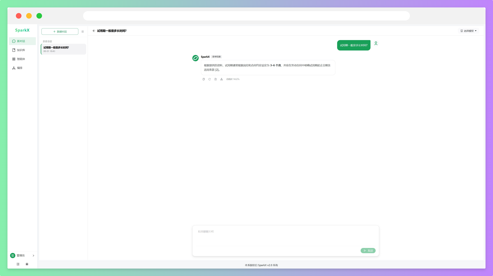
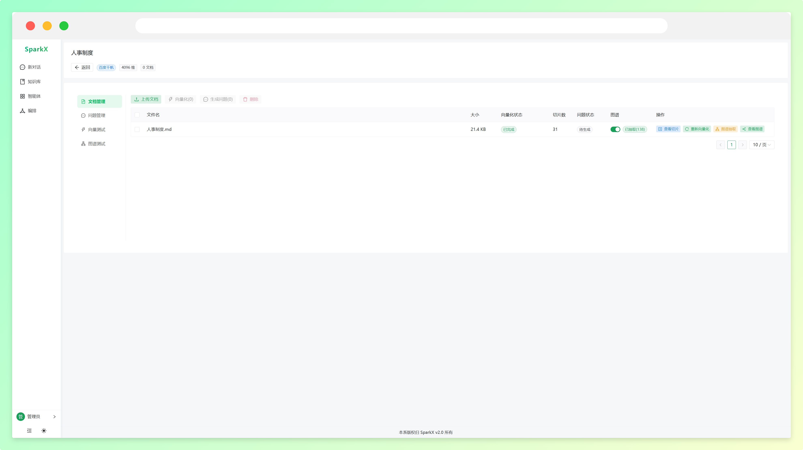
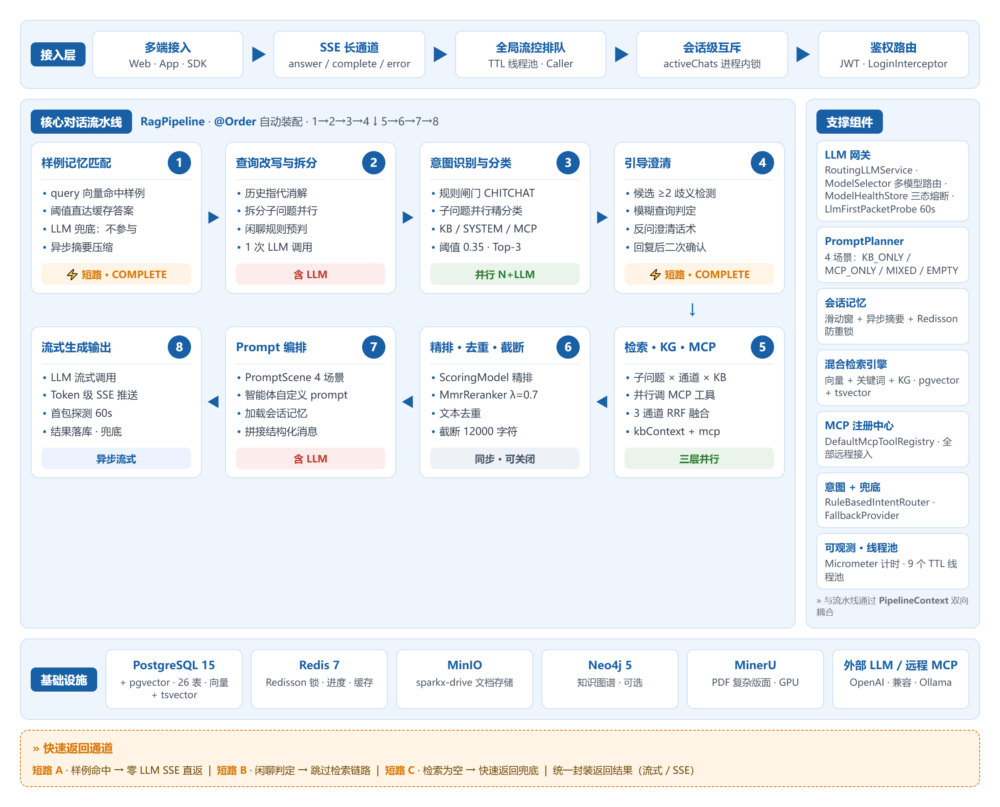
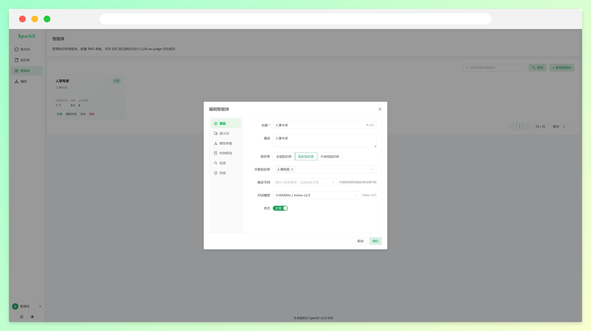
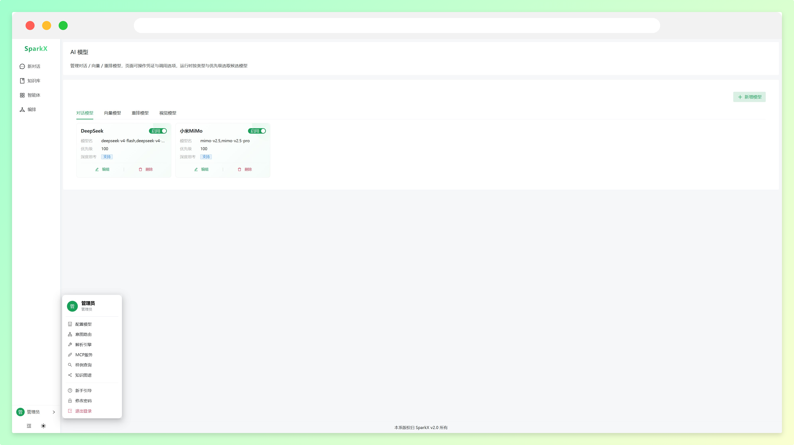
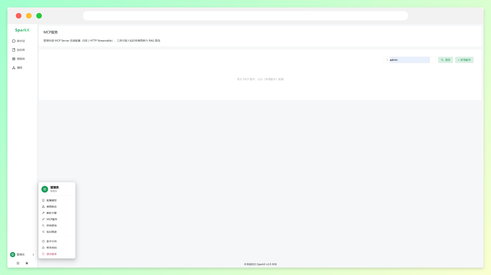
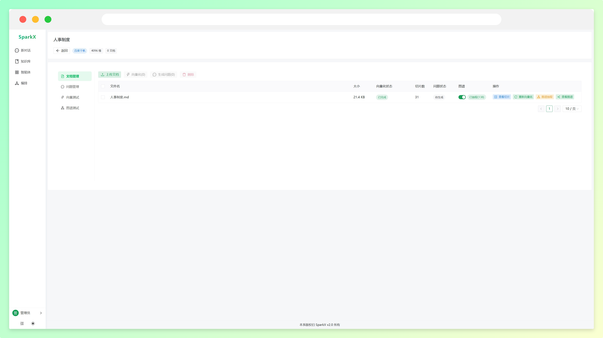
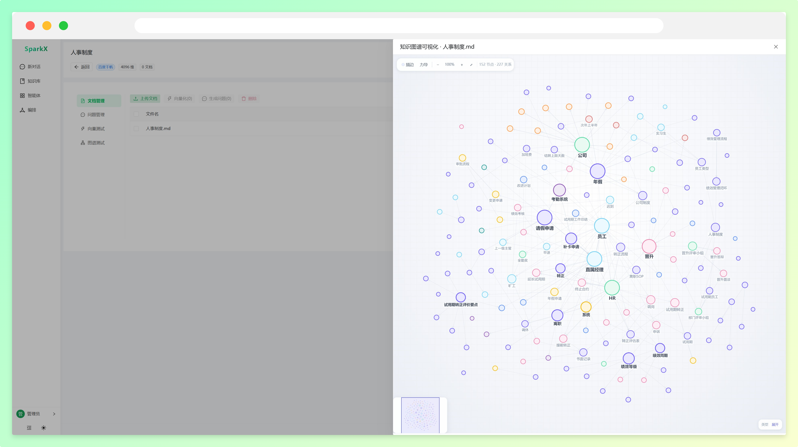

<p align="center">
  <a href="https://gitee.com/shop-sparker/spark-x">
    
  </a>
</p>

<p align="center">
  <strong>基于大语言模型与编排的企业级 AI 智能体开发平台</strong><br/>
</p>

<p align="center">
  <a href="https://gitee.com/shop-sparker/spark-x/stargazers"></a>&nbsp;
  <a href="https://gitee.com/shop-sparker/spark-x/members"></a>&nbsp;
  <a href="./LICENSE"></a>
  
  
  
</p>

## 🚀 什么是 SparkX？

SparkX 是一个采用 **大语言模型 + 可视化编排** 构建的企业级 AI 智能体开发平台，覆盖从知识库入库、检索增强、智能体对话到工作流编排的完整链路。开箱即用、模型任选、灵活编排，支持快速嵌入到第三方业务系统。

- **模型任选**：基于 `LangChain4j` 统一封装，接入 OpenAI 兼容标准接口，几乎覆盖市面上所有主流大模型——不限于官方服务，也支持 Ollama 等自建模型。
- **RAG 索引增强**：自研多路检索管线，向量 + 关键词混合检索，父子分块扩展 + MMR 去冗余 + 重排精排，有效消除大模型幻觉，对私有数据问答尤为有效。
- **灵活编排**：基于 `AntV X6` 可视化流程引擎，让多个 Agent 按节点图协同工作，覆盖单轮问答无法承载的复杂业务场景。
- **模型容错**：多模型路由 + 三态熔断器 + 首包探测 + 优先级降级链，单个模型供应商故障不影响业务。
- **MCP 无限扩展**：原生集成 MCP 协议（langchain4j-mcp），让 AI 自由调用外部业务工具，能力无上限。
- **嵌入简单**：单页面 / 弹层两种嵌入方式，被嵌入系统无需任何改造即可接入 AI。

一句话：**生产落地智能体会踩的坑，这里都有对应方案**。一套经过真实场景锤炼的工程实践，系统覆盖 RAG / Agent / MCP / 编排等核心能力。



## 🧭 快速导航

> 觉得不错？先点个 Star 收藏 👇

| &nbsp; | 链接 | 说明 |
|:---:|:---|:---|
| 📖 | <a href="https://x.sparkshop.cn/" target="_blank">使用手册</a> | SparkX 完整使用文档 |
| 🚀 | <a href="#-快速开始" target="_blank">快速开始</a> | Docker 一键启动前后端 |
| 💡 | <a href="#-为什么需要-sparkx" target="_blank">为什么需要 SparkX</a> | 设计思考与价值 |
| 🏗️ | <a href="#-sparkx-核心设计" target="_blank">核心设计</a> | 架构与工程实践 |

---

## 💡 为什么需要 SparkX？

AI 这波浪潮，企业已经躲不过去了。

不管是客服、运营、还是内部 IT，都在想办法把大模型接进自己的业务。但真正动手时会发现：调个 API 容易，做出一个**能上线、能扛住生产流量、能持续运营**的智能体系统，坑多到怀疑人生。

<details>
<summary><b>企业落地 AI 智能体的 4 个真实痛点</b>（点击展开）</summary>

### 1. 模型不稳定，挂了怎么办？

线上不可能只依赖一个模型供应商。网络抖动、限流、服务降级随时发生。如果系统只接了一家，它一挂，整个智能体就哑火。

SparkX 的做法是：**多候选路由 + 三态熔断 + 自动降级**。一个模型挂了，自动切到下一个候选，配合首包探测保证切换对用户无感知。

### 2. 知识库问答不准，幻觉满天飞

直接把原始文档塞给模型，回答质量看天吃饭。用户问"报销流程"，模型可能给你编一个不存在的流程。

真正的 RAG 系统要考虑：文档怎么切分最合理？混合检索怎么融合排序？召回结果怎么去重精排？上下文怎么压缩不超 Token？每一环都是工程决策。

### 3. 单轮问答不够用，复杂场景怎么搞？

很多业务不是一问一答能解决的——查订单要带用户信息、走审批要调多个接口、处理工单要按步骤来。单纯的 RAG 智能体搞不定。

SparkX 提供了**可视化工作流编排**，把多个节点串成图，让 AI 按流程协同工作，而不是只会一问一答。

### 4. 接入业务系统太重，改造成本高

市面上不少 AI 平台要求你把数据迁过来、改你的系统架构，集成成本高到劝退。

SparkX 支持**单页面 / 弹层**两种嵌入方式，被嵌入系统无需任何改造，几分钟就能让现有系统拥有 AI 能力。

</details>

## 🏗️ SparkX 核心设计

采用前后端分离架构。后端按职责划分模块，知识库（RAG）子系统自包含，移植自经过生产验证的 sparkxV2。

```
spark-x/
├── admin/      # Vue3 + Naive UI 管理后台（智能体/知识库/AI配置/编排/对话调试）
├── server/     # Spring Boot 3.4 后端（包根 sparkx.sparkshop）
└── docker/     # 一键编排（backend + frontend + PgSQL + Redis + MinIO）
```

后端核心模块：

| 模块 | 职责 |
|---|---|
| `knowledge/` | 知识库 / RAG / 智能体子系统（自包含，最大模块） |
| `workflow/` | 工作流编排引擎（可视化节点图执行） |
| `evaluation/` | 评测（意图分类评估面板） |
| `system/` | 系统模块（用户/鉴权/通用） |
| `common/` | 通用基础设施（config / exception / utils） |

> 分层不是为了炫技，而是解决实际问题：`knowledge` 子系统内部进一步按 pipeline / retrieval / ingest / infra / mcp / intent / graph 分包，换模型供应商不用改业务代码，加检索通道不用动生成逻辑。



一次用户提问，在 SparkX 服务里经过的 RAG 核心链路如下：

> 实际项目代码中，逻辑比图表上更加复杂。下图仅展示核心流程。



<details>
<summary><b>检索引擎 / 模型容错 / 入库 Pipeline 详解</b>（点击展开）</summary>

### 多路检索 + 后处理流水线

检索通道独立执行、互不影响，通过线程池并行调度；后处理器按顺序串联，像流水线一样逐步精炼结果。

- **检索通道**：`ConditionalRetrievalChannel`（接口，意图驱动是否启用）← `IntentDirectedChannel` / `VectorKeywordHybridChannel`（向量 + 关键词混合）
- **后处理器链**：`DeduplicationPostProcessor`（去重）→ `RerankPostProcessor`（重排）→ `MmrReranker`（MMR 去冗余）
- **父子扩展**：`ParentChildRetriever` 子块命中时扩展到父块，召回更完整上下文
- **多通道融合（RRF）**：`FusionPostProcessor` 按 `app.rag.fusion.*` 配置做 Reciprocal Rank Fusion

### 模型路由与三态熔断

生产环境不可能只依赖一个模型供应商。SparkX 的容错层解决的就是"模型不稳定怎么办"：

```
RoutingLLMService（路由入口）
        │
        ▼
   ModelSelector（按策略选模型）
        │
        ▼
   多 Provider 客户端
   ┌──────────────────┬──────────────────┐
   │ OpenAICompatible │   OllamaChat     │
   └──────────────────┴──────────────────┘
        │
        ▼
   ModelHealthStore（三态熔断：CLOSED → OPEN → HALF_OPEN）
        │
        ▼
   LlmFirstPacketProbe（首包探测，切换无感知）
```

每个模型独立维护健康状态。失败次数达阈值自动熔断，冷却期后进入半开放状态放行探测请求，探测成功恢复、失败继续熔断。配合优先级降级链，一个模型挂了自动切下一个候选。

### 文档入库 Pipeline

文档从上传到可检索，经过一条基于节点编排的 Pipeline：

```
fetch → parse → chunk → enrich → enhance → index
 抓取    解析    分块    增强     优化      入库
```

- **解析**：Apache Tika / PDFBox / POI 多格式支持；PDF 复杂版面走 MinerU（自建 / 云端可配）
- **分块**：自适应分块（`adaptiveSplitter`）+ 父子分块（`parentChildSplitter`），按文档类型选择策略
- **入库**：`IngestionEngine` 跑节点图，每个任务和节点都有独立执行日志，出问题能精确定位到哪一步

### 设计模式实战

SparkX 不是为了用设计模式而用，每个模式都对应一个具体的工程问题：

| 设计模式 | 应用场景 | 解决的问题 |
|---|---|---|
| 策略模式 | 检索通道、后处理器、MCP 工具执行器 | 检索通道 / 后处理器 / 工具可插拔替换 |
| 模板方法 | Pipeline Stage 基类 | 阶段统一执行流程，子类只关注核心逻辑 |
| 责任链模式 | 后处理器链、模型降级链 | 多个处理步骤按顺序串联，灵活组合 |
| 装饰器模式 | 首包探测回调 | 不修改原有回调的前提下增加探测能力 |
| 注册表模式 | MCP 工具注册中心、意图节点注册表 | 组件自动发现与注册，新增工具零配置 |
| AOP | `@RagTraceNode` 链路追踪切面 | 追踪逻辑与业务代码解耦 |

</details>

## ✨ 项目质量怎么样？

说一个平台是企业级，不能光靠嘴说，得看实际的工程质量。

### 1. 工程规范

- **分层架构**：`knowledge` 子系统内部按 pipeline / retrieval / ingest / infra / mcp / intent / graph / memory / fallback / tenant 分包，职责清晰，不存在基础设施代码和业务代码混在一起。
- **设计模式实战**：策略、模板方法、责任链、装饰器、注册表——每个都解决实际的扩展性或解耦问题。
- **配置即数据**：模型配置走 `ai_model` 表（页面可编辑，运行时动态读取覆盖 yml 默认值），而不是写死在配置文件里。
- **多租户隔离**：`TenantContext` + `TenantInterceptor`，向量查询自动按租户元数据过滤，不同租户看到的知识库互不干扰。

### 2. 可扩展性

衡量一个平台是否企业级的关键指标。SparkX 的核心模块都预留了扩展点：

- **新增检索通道**：实现 `ConditionalRetrievalChannel` 接口，注册为 Spring Bean，自动生效。
- **新增 RAG 阶段**：实现 `PipelineStage`，加 `@Component @Order(n)` 即自动并入流水线。
- **新增 MCP 工具**：通过 MCP 服务管理页面配置，原生支持 MCP 协议。
- **新增模型供应商**：实现 ChatClient 接口，配置候选列表即可参与路由。

> 不需要改框架代码，不需要改硬编码列表，加个实现类就完事了。这才是面向接口编程的正确打开方式。

### 3. 生产级特性

| 特性 | 说明 |
|:---|:---|
| **模型容错** | 多候选路由 + 三态熔断器 + 首包探测 + 优先级降级链 |
| **流式输出** | SSE 实时推送，首包探测保证模型切换时用户无感知 |
| **可观测性** | 基于 AOP 的全链路 Trace（`@RagTraceNode`），每个环节耗时、输入输出都有记录 |
| **会话管理** | 对话记忆（历史轮次 + 摘要压缩），不会因为轮次多了就 OOM 或 Token 爆炸 |
| **多租户** | 向量查询元数据过滤，租户间知识库隔离 |
| **认证鉴权** | 基于 JWT 的用户认证体系，不是裸奔的 API |
| **对象存储** | MinIO 企业云盘，bucket `sparkx-drive` |

### 4. 数据库设计

26 张业务表，涵盖完整业务域：

- **知识库域**：`knowledge_base` `document` `chunks` `parent_chunks`（父子分块）`knowledge_question`
- **智能体域**：`knowledge_agent`（智能体配置）`t_chat_session` `t_chat_message`
- **对话记忆**：`t_conversation_message` `t_conversation_summary`（历史 + 摘要）
- **意图与样例**：`t_intent_node`（意图树）`sample_query` `sample_query_config`（样例查询）
- **入库流水线**：`t_ingestion_task_node` `t_ingestion_pipeline_node`
- **AI 模型**：`ai_model`（对话/向量/重排/视觉）`ext_service_config`（MinerU 等外部服务）
- **知识图谱**：`kg_config` `kg_entity` `kg_extraction_record`
- **MCP**：`mcp_server` `mcp_tool`
- **工作流**：`workflow` `workflow_runtime` `workflow_runtime_context`

> 数据库是 PostgreSQL（带 vector 扩展），不是 MySQL。向量检索直接用 PgSQL 的 vector 能力，无需额外引入向量数据库。

### 5. 完整控制台

SparkX 提供完整的可视化管理后台，覆盖智能体开发的全生命周期。

#### 智能体管理

支持配置智能体的知识库范围（全部 / 指定 / 无）、对话模型、提示词、欢迎语、建议问题、检索参数（TopK / 向量阈值 / 关键词阈值）、重排参数、改写模型、兜底策略。



#### 知识库

文档上传、分块管理、命中测试、问答对管理、入库流水线监控。


#### AI 模型配置

统一管理对话 / 向量 / 重排 / 视觉四类模型，支持 OpenAI 兼容接口与 Ollama 自建模型。



#### MCP 工具

配置 MCP 服务，让 AI 自由调用外部业务工具。



#### 可视化编排

基于 AntV X6 的流程编排引擎，让多个 Agent 按节点图协同工作。


#### 对话调试

实时 SSE 流式对话调试，查看引用来源、各阶段耗时。



#### 系统设置



## 🛠️ 技术架构

**后端**：Java 17 + Spring Boot 3.4 + MyBatis-Plus + LangChain4j 1.18 + PostgreSQL(vector) + Redis(Redisson) + MinIO + WebSocket

**前端**：Vue 3 + TypeScript + Vite + Naive UI + Alova(HTTP) + AntV X6(编排)

**AI 能力**：LangChain4j（模型统一封装）+ langchain4j-mcp（MCP 协议）+ langchain4j-community-neo4j（知识图谱）+ Apache Tika/PDFbox/POI（文档解析）+ HanLP（中文分词）

```
本地开发建议版本
Java 17、Node.js v22.17.0、NPM 10.9.2、PgSQL 15、Navicat Premium Lite 17
未提及的，可以使用任意版本或者项目中已经约定了版本。
```

<details>
<summary><b>核心依赖一览</b>（点击展开）</summary>

| 依赖 | 版本 | 用途 |
|---|---|---|
| Spring Boot | 3.4.13 | Web 框架 |
| LangChain4j | 1.18.1 | 大模型统一封装 |
| langchain4j-mcp | 1.18.1-beta28 | MCP 协议集成 |
| langchain4j-community-neo4j | 1.18.0-beta28 | 知识图谱 |
| MyBatis-Plus | 3.5.7 | ORM |
| Redisson | 3.31.0 | 分布式锁 / 缓存 |
| MinIO | 8.5.12 | 对象存储 |
| HanLP | portable-1.8.6 | 中文分词 |
| TransmittableThreadLocal | 2.14.5 | 跨线程上下文透传 |

</details>

## 🚀 快速开始

### 1. 下载源码

```bash
git clone https://gitee.com/shop-sparker/spark-x.git
```

### 2. Docker 一键启动

```bash
cd spark-x/docker
docker compose up -d
```

会自动拉起：后端（sparkx-server）+ 前端（Nginx）+ PostgreSQL + Redis + MinIO。

### 3. 访问

```
http://localhost:8189
```

账号 `admin`
密码 `admin`

## 📖 使用手册

完整使用文档：https://x.sparkshop.cn/

## 📌 迭代计划

- [ ] 编排增加数据库节点
- [ ] 编排增加 API 节点
- [ ] 系统支持 API 调用
- [ ] 支持 SearXNG 搜索功能
- [ ] 支持智谱 AI 搜索功能
- [ ] 支持图片理解

## 🤝 交流群


#### 了解更多细节可咨询


## 📄 版权信息

1. 允许用于个人学习、毕业设计、教学案例、公益事业、商业使用。
2. 如果商用必须保留版权信息，请自觉遵守。

---

<p align="center">
  如果觉得项目还不错，点个 Star 支持一下！
</p>
